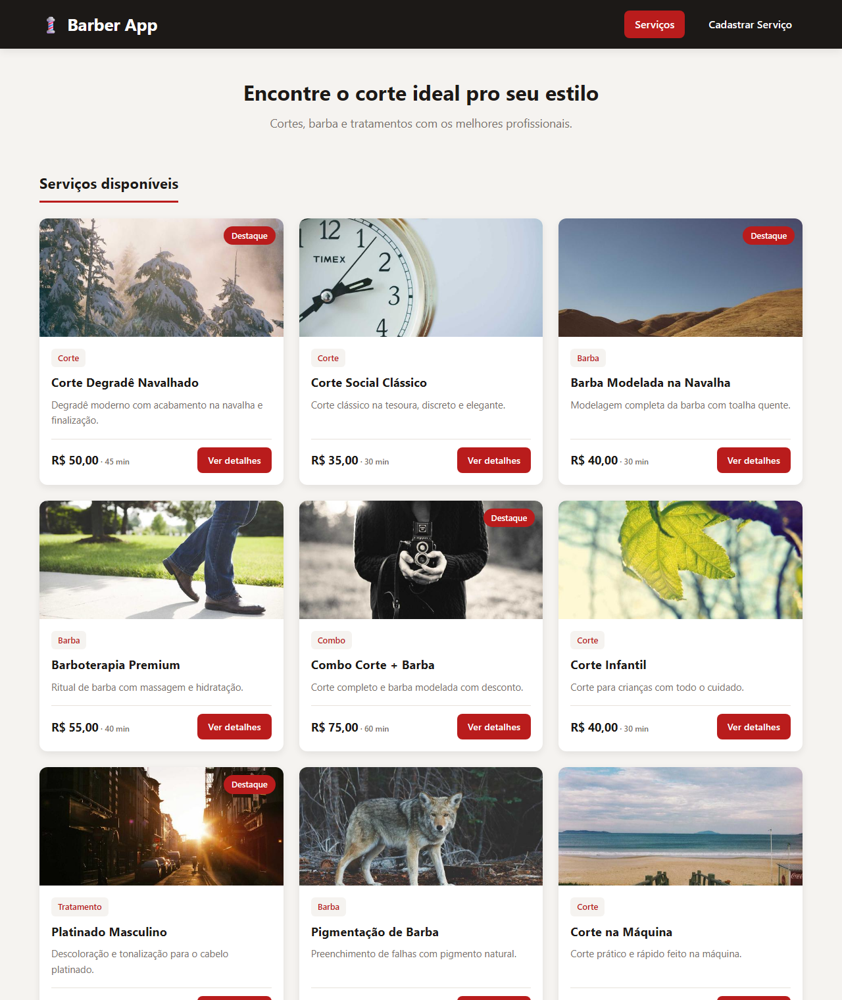
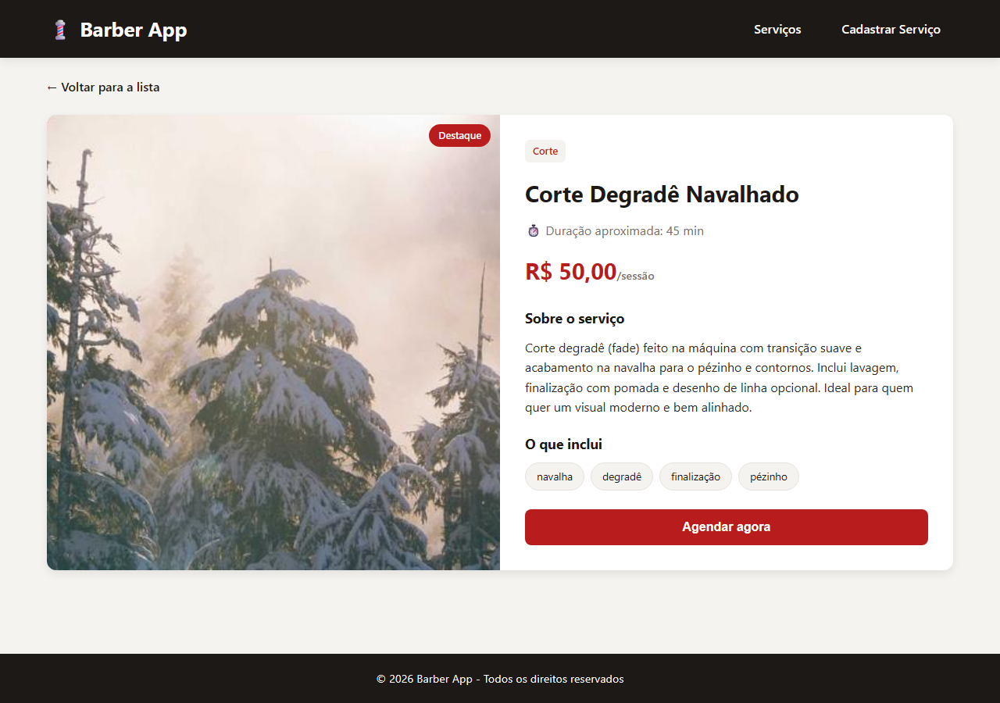

[](https://classroom.github.com/a/_2wsftuC)

# Trabalho Prático - Semana 13

JSON Server + Fetch API + detalhes por QueryString. Nesta etapa os dados que antes ficavam fixos no JavaScript foram migrados para um `db.json` servido pelo **JSON Server**, com cards consumidos via Fetch API, uma página de detalhes acessada por QueryString e uma página de cadastro (CRUD) da entidade principal.

## Informações do trabalho

- **Nome:** Lucas Oliveira Dias
- **Matrícula:** 907253
- **Proposta de projeto escolhida:** Barber App
- **Breve descrição sobre seu projeto:** Plataforma para uma barbearia apresentar seus serviços (cortes, barba, combos e tratamentos), permitindo consultar os detalhes de cada serviço e cadastrar novos serviços.

## Estrutura do `db.json`

O `db.json` contém quatro coleções:

| Coleção         | Descrição                                                              |
| --------------- | --------------------------------------------------------------------- |
| **servicos**    | Coleção principal. Cada item representa um serviço da barbearia.       |
| **categorias**  | Tipos de serviço (Corte, Barba, Combo, Tratamento).                    |
| **avaliacoes**  | Notas e comentários deixados por clientes para cada serviço.           |
| **favoritos**   | IDs dos serviços marcados como favoritos.                             |

### Exemplo de um item da coleção `servicos`

```json
{
  "id": 1,
  "nome": "Corte Degradê Navalhado",
  "descricaoCurta": "Degradê moderno com acabamento na navalha e finalização.",
  "descricaoCompleta": "Corte degradê (fade) feito na máquina com transição suave e acabamento na navalha para o pézinho e contornos...",
  "imagem": "https://picsum.photos/seed/barber1/600/400",
  "categoria": "Corte",
  "valor": 50,
  "duracao": 45,
  "tags": ["navalha", "degradê", "finalização", "pézinho"],
  "destaque": true
}
```

### Resumo dos dados

- **12 serviços** cadastrados (mínimo exigido: 10)
- **4 categorias** distintas (mínimo exigido: 4)

## Estrutura de arquivos

```
.
├── db/
│   └── db.json                  # Base de dados (JSON Server)
├── public/
│   ├── index.html               # Home com cards
│   ├── script.js                # Lógica da Home
│   ├── details.html             # Página de detalhes
│   ├── details.js               # Lógica da página de detalhes
│   ├── cadastro_servico.html    # Formulário de cadastro (CRUD)
│   └── styles.css               # Estilos globais
├── images/                      # Prints da aplicação
├── package.json
└── README.md
```

## Como executar

Na pasta do projeto:

```bash
npm install
npm start
```

O JSON Server sobe em `http://localhost:3000`. Endpoints principais:

- Lista completa: `http://localhost:3000/servicos`
- Item específico: `http://localhost:3000/servicos/1`
- Outras coleções: `http://localhost:3000/categorias`, `/avaliacoes`, `/favoritos`

Abra o front-end (`public/index.html`) no navegador para consumir a API.

## Funcionalidades implementadas

- [x] `db.json` com estrutura organizada e 12 itens
- [x] JSON Server rodando e respondendo via REST
- [x] Home busca dados via Fetch e renderiza cards dinamicamente
- [x] Botão "Ver detalhes" navega para `details.html?id=...`
- [x] Página de detalhes lê o `id` com `URLSearchParams`
- [x] Página de detalhes busca o item pelo endpoint `/servicos/{id}`
- [x] Tratamento de erro para id ausente e item inexistente
- [x] Página de cadastro (POST para o JSON Server)

## Capturas de tela

### Home (index.html)



### Página de detalhes (details.html)



## Tecnologias

- HTML5, CSS3 e JavaScript (vanilla)
- Fetch API para requisições assíncronas
- URLSearchParams para leitura de QueryString
- JSON Server como backend simulado
- Node.js como runtime do JSON Server
